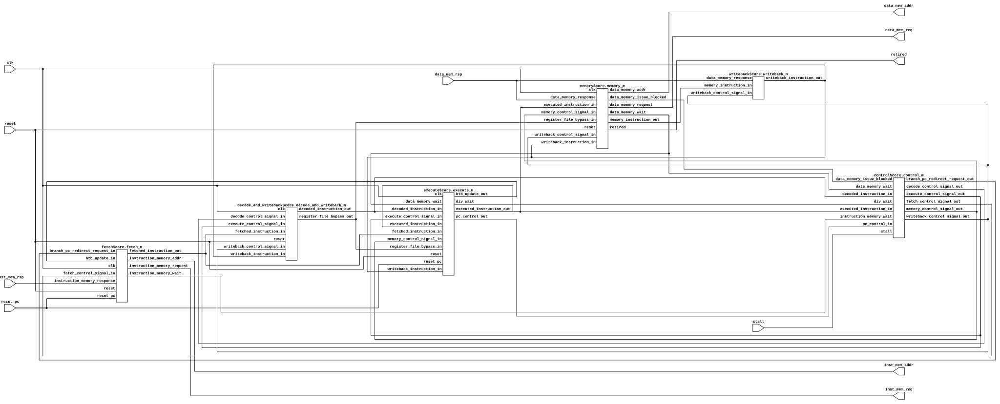
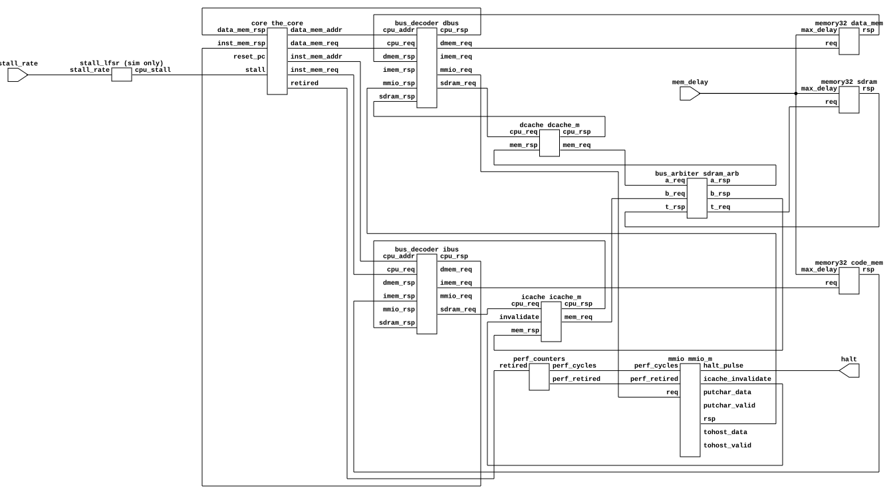

<div align="center">

<picture>
  <source media="(prefers-color-scheme: dark)" srcset="docs/assets/banner-dark.svg">
  
</picture>

<p>
  <a href="#getting-started">Getting started</a> ·
  <a href="#architecture">Architecture</a> ·
  <a href="#verification">Verification</a>
</p>

</div>

murtCPU is a RV32IM_Zicsr_Zicntr RISC-V processor built from scratch as a learning experience in SystemVerilog. Architecturaly murtCPU is a five-stage pipeline capable of running compiled C and is compliant with the official RISC-V spec. murtCPU features a small SoC around it with I/D memories, MMIO, and SDRAM behind 16 KiB I/D caches. murtCPU is benchmarked using CoreMark at 2.96 and 2.67 CoreMark/MHz on the core and system configs.

## Getting started

```bash
git clone --recursive https://github.com/Murt2005/RV32i-pipelined
cd RV32i-pipelined
$EDITOR site-config.sh   # point it at your RISC-V toolchain and simulators
make                     # build and run every riscv-tests suite
```

That runs rv32ui, rv32um and rv32mi in both configurations. From there you can do:

```bash
make riscv-arch-test     # the official architectural tests, from SDRAM
make coremark            # run CoreMark and print CoreMark/MHz
make cosim-test          # check every retired instruction from riscv-test   against Spike
make help                # every target and option
```

<details>
<summary><b>What you need installed</b></summary>

- RISC-V GCC (`riscv64-unknown-elf-*`)
- [Icarus Verilog](https://github.com/steveicarus/iverilog)
- [Verilator](https://www.veripool.org/verilator/)
- Python 3
- `dtc`
- [mise](https://mise.jdx.dev/), [Sail](https://github.com/riscv/sail-riscv/releases/tag/0.14.1) 0.14.1, and on macOS Homebrew's `z3`
- yosys, sby, sv2v and an SMT solver (see [`formal/README.md`](formal/README.md))

`site-config.sh` holds the path to each of these.

</details>

## Architecture

**Core**

<a href="docs/assets/core.svg"></a>

**System**

<a href="docs/assets/system.svg"></a>

### Configurations

Programs can be built as one of two configurations chosen with `CONFIG`:

| `CONFIG` | Program lives in | CoreMark |
|---|---|---|
| `core` | IMEM and DMEM | 2.96 CoreMark/MHz |
| `system` | SDRAM with SoC, via a boot stub in IMEM | 2.67 CoreMark/MHz |

<details>
<summary><b>Memory Map</b></summary>

| Address | What |
|---|---|
| `0x0001_0000` | Instruction memory, 64 KiB |
| `0x0002_0000` | Data memory, 64 KiB |
| `0x0002_FFC0` | MMIO (see more at `rtl/bus/memory-map.sv`)|
| `0x8000_0000` | SDRAM, 1 MiB, behind 16 KiB I/D caches |

</details>

<details>
<summary><b>CSRs and exceptions</b></summary>

| CSRs | |
|---|---|
| Read/write | `mstatus`, `mtvec`, `mscratch`, `mepc`, `mcause`, `mtval`, `mcycle[h]`, `minstret[h]` |
| Read-only | `misa`, `cycle[h]`, `time[h]`, `instret[h]`, and the ID registers which read zero |
| Always zero | `mie`, `mip`, `mstatush`, `tselect`, `tdata1`, `tdata2` |

Accessing any other CSR or writing a read-only one is an illegal instruction.

| `mcause` | Raised by |
|---|---|
| 0 | Jump or taken branch to an address that isn't 4-byte aligned |
| 2 | Illegal instruction |
| 3 | `ebreak` |
| 4 / 6 | Misaligned load / store |
| 11 | `ecall` |

</details>

## Verification

murtCPU has been extensively verified through multiple verification layers. There are four main verification sources: riscv-tests, riscv-arch-tests, a lockstep co-simulator harness against Spike, and formal verification (to a degree) with riscv-formal. 

The riscv-tests cover the rv32ui, rv32um, and rv32mi test suites in both configurations. The riscv-arch-tests cover 97 official RISC-V spec tests for a RV32I core with the M, Zicsr, and Zicntr extensions, checked against the Sail reference model.

A lockstep co-simulator runs murtCPU against Spike and compares the PC, result, and memory access of every retired instruction from an RVFI port. It runs the riscv-tests as well as random programs and on a mismatch it stops and prints both sides and the ten instructions before it; full traces can be found in `build/trace/<test>.log`.

murtCPU can also be ran with memories up to 16 cycles late and random stalls to catch stall bugs and test slower memory.

murtCPU includes the riscv-formal checks which formally proves that each retired instruction matches the spec for every operand value and pipeline state within a bounded depth; see [`formal/README.md`](formal/README.md) for more.
